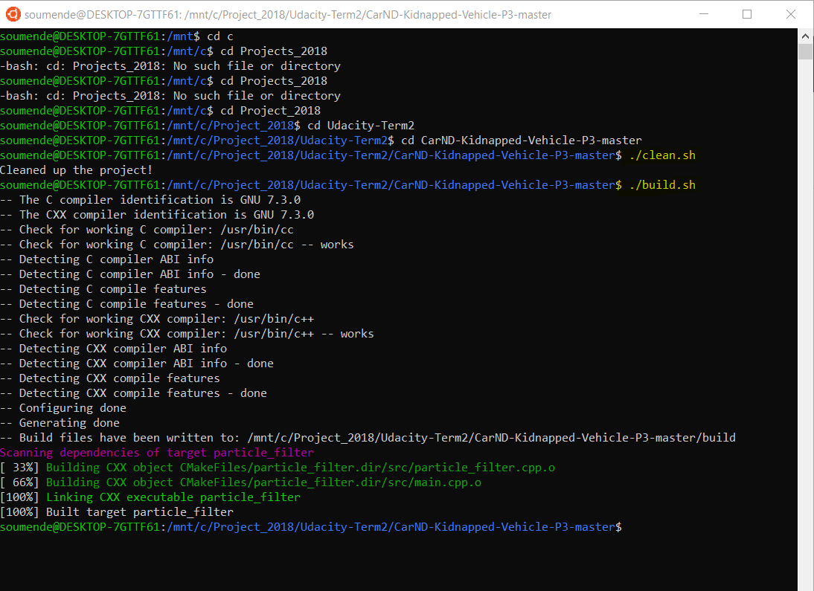
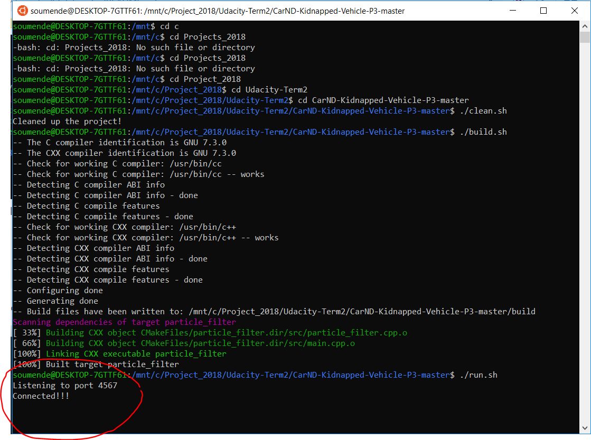
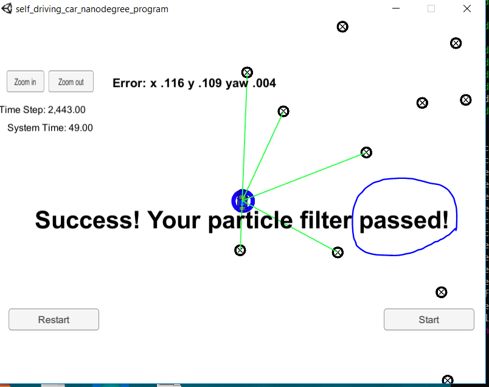

# CarND-Kidnapped-Vehicle-P3
This is the Term 3 project on Kidnapped Vehicle localization

# Overview

This project implements a [Particle Filter](https://bit.ly/2A8MHpJ) which was taught is Chapter 13 section of Term 2 class. A vehicle is simulated to be kidnnaped and it need to locate itslef using sensor and map data. A simulator is provided by Udacity ([ downloaded here](https://github.com/udacity/self-driving-car-sim/releases)). This simulator will generate noisy landmark observation from the kidnapped car to the Particle Filter using [WebSocket](https://en.wikipedia.org/wiki/WebSocket). The Particle Filter uses the [uWebSockets](https://github.com/uNetworking/uWebSockets) WebSocket implementation to respond to this observation with the estimated car position. Udacity provides a seed project to start from on this project ([here](https://github.com/udacity/CarND-Kidnapped-Vehicle-Project)).

# Prerequisites

The project has the following dependencies (from Udacity's seed project):

- cmake >= 3.5
- make >= 4.1
- gcc/g++ >= 5.4
- Udacity's simulator.

For instructions on how to install these components on different operating systems, please, visit [Udacity's seed project](https://github.com/udacity/CarND-Kidnapped-Vehicle-Project). This implementation was done Windows 10 OS using Ubuntu Shell. .


In order to install the necessary libraries, use the [install-mac.sh](./install-mac.sh).

# Compiling and executing the project

In this project, Udacity's seed repo provides scripts to clean, compile and run it. These are the following commands you need to run from this repo directory

```
> ./clean.sh
> ./build.sh
> ./run.sh
```

You will see a message indicating the filter is listening:

```
> ./run.sh
Listening to port 4567

```


When you open the simulator the following screen appears:


Using the right arrow, you need to go to the Kidnapped Vehicle project:


Clicking on "Select," the simulator for the Kidnapped project start and the Particle Filter informs it is connected:


Clicking on "Start" button, the vehicle starts moving, and the blue circle(the filter calculated position) moves with it. After 2443 time steps, the simulator informs that Particle Filter passed or failed. Here is an screen shot of the filter passing the test:

 

# Code description

[src/ukf.cpp line 13](./src/ukf.cpp#L13)

The Particle Filter is implemented in [src/particle_filter.cpp](./src/particle_filter.cpp):

- Initialization: Particle initialization is implemented at [ParticleFilter::init line 24-62](./src/particle_filter.cpp#L24) 

- Prediction: The prediction step is implemented at [ParticleFilter::prediction line 64-100](./src/particle_filter.cpp#L64) 

- Weight's update: This is the more important operation in my opinion. It is implemented at [ParticleFilter::updateWeights line 138-217](./src/particle_filter.cpp#L64) 

The main function parses the received message  using event handler which  calls the Particle Filter to locate the kidnapped vehicle [src/main.cpp](./src/main.cpp). The event handler is declared at [line 49](./src/main.cpp#L49) 
